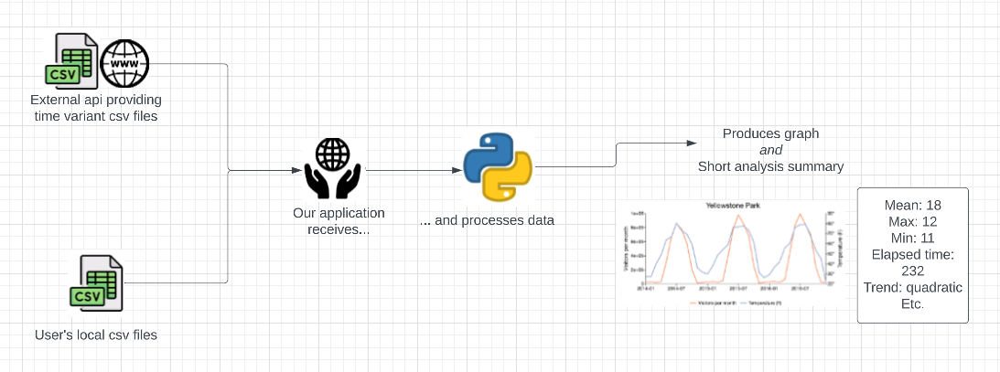

# EECE3039C Semester Project Description - Team Keith

## Links
[C++ API repository](https://github.com/EECE3093C/team-project-keith-cpp-api)

## Vision

• What is the product?

This project is aiming to create an application that will process and analyze time series data, either from a user or an open source database. Analysis includes descriptive statistics and graphs that plot data points over time. The analysis will be acheivable even when limited specifications are given, for example, a user would just need to specify a file name in the simplest case.

• Whom is it for?

This application would be targeted towards individuals possesing varying sizes of data sets which consist of time series data. Other individuals who do not have this kind of data on hand but would like to see the capabilities of the software can get sample data from open source APIs through the application.

• What problem does it solve?

Often times the analysis of data involves writing or importing data sets into statistical software packages like Excel, Power-BI and Tableau. Or using more hands on software like R-Studio or python libraries. Even using sophisticated software like Excel can make the data analysis process take a good deal of time and become very complicated. Our application endeavors to give a simple alternative that provides fast analysis on a data set before someone sinks hours into working with it.

• What alternatives are available, who are the competitors?

Excel has a quick analysis tool that accomplishes similar tasks to this project but is not focussed on any particular kind of data. These quick insights also exist in Power-BI. 

• What is novel in the approach, that is why is this project compelling and worth
developing?

Fast analysis of time series data does not currently seem to be solely supported by an application that users can take advantage of. This makes this application worth developing because time series data is being created all the time, from financial market data to sensors in smart technology, and this data needs to be analyzed efficiently. 

### Software Architecture

There are many modules and libraries that exist that can aid in the analysis and visualuzation of data. In Python alone there is Matplotlib and pandas which are rich libraries with many tutorials for data analysis and visualization. Processing of this data can be done by robust object-oriented principles through C++. The visualization can be represented to the user though intuitive UI that can be easily created through open source tools like PyQt. 

Users will be able to either import their own local data sets or access them through online databases. These data sets will be time series data that would then be processed through a C++ API. This API will essentially deal with the most time consumming process, finding the time data column and all other relevant data columns and put those into data structures. The processed data would be passed to the python layer to perform analysis and visualization. This visualization would be presented to the user in the UI. 

Time series data provided by the user or accessed through online databases will be used but not stored. No user data will be stored in this application. The application will focus on using Python and C++ as well as the python packages Matplotlib, pandas, and PyQt.

### Challenges and Risks

It will be very important to make sure that all of the pieces of the project will work together. The user will need to be able to access personal files, we must be able to get data from the online API and our C++ API will need to communicate with the python code. It may be difficult and time consuming to learn how to make all of these processes communicate correctly. We will take time to research the tools we want to use and take time to properly plan each phase of the implementation and this should mitigate risks.
