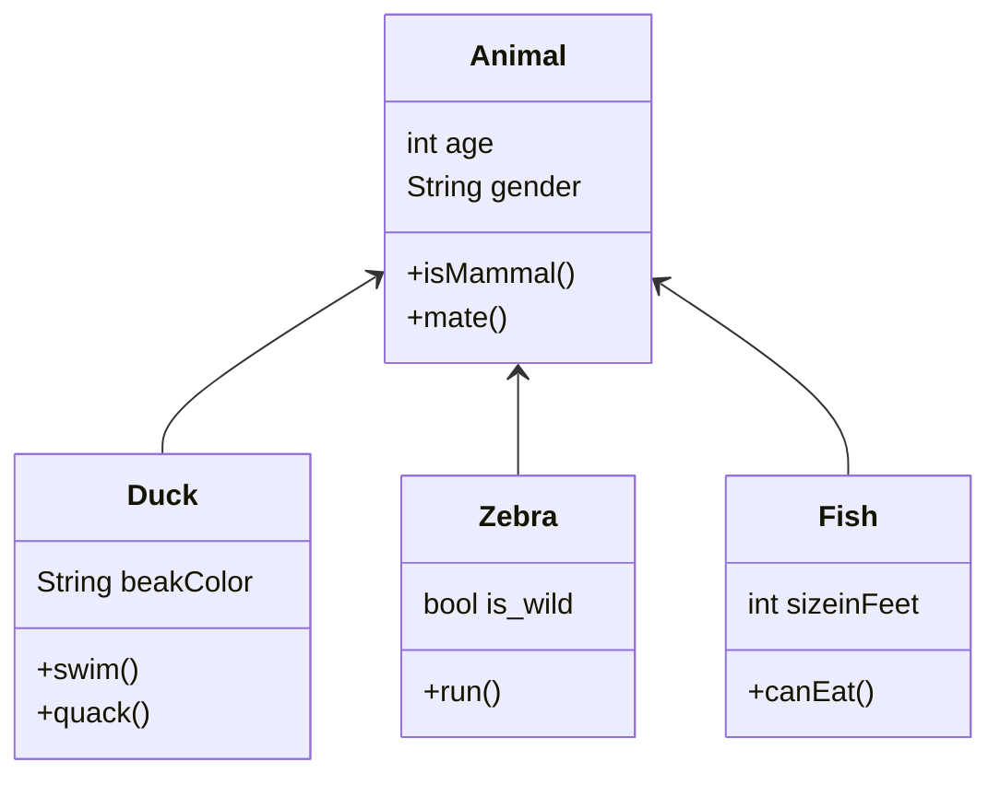

# Writing on GitHub Assignment

Software engineers need to be able to communicate technical information effectively to various<br />
stakeholders, including team members, clients, and management. Technical writing enables<br />
us to present complex information in a clear and concise manner, ensuring that everyone<br />
has a comprehensive understanding of the software being developed. This helps to avoid<br />
misunderstandings, delays, and other problems that can arise when technical information is<br />
not communicated effectively.

This assignment is a simple introduction to writing on GitHub using **Markdown**. GitHub<br />
has its own flavor of Markdown[^1], so you must follow their syntax. Please see the [“Writing on](https://docs.github.com/en/get-started/writing-on-github)<br />
[GitHub”](https://docs.github.com/en/get-started/writing-on-github) documentation published by GitHub for more details on their Markdown syntax.<br />
[^1]: [GitHub Flavored Markdown Spec](https://docs.github.com/en/get-started/writing-on-github)
### Fenced Code Blocks
You can create fenced code blocks by placing triple backticks \``` 
before and after the code<br />
block. Syntax highlighting in your fenced code block is enabled by adding an optional language<br />identifier. For example, to syntax highlight Python code your fenced code block would begin with<br /> ```**python**.<br />

```python
class Circle():
  def __init__(self, r):
    self.radius = r
    
def area(self):
  return self.radius**2*3.14
  
def perimeter(self):
  return 2*self.radius*3.14
```
### Mathematical Expressions
GitHub supports LaTeX formatted math within Markdown, it uses the cross-browser<br />
JavaScript libary MathJax for rendering. Here is a mathematical expression for Binomial<br />
coefficients:<br />
<p align="center">
$\binom{n}{k} = \frac{n!}{k!(n-k)!}$</p>


### Diagrams
You can create diagrams in Markdown using four different syntaxes: mermaid, geoJSON and<br />
topoJSON, and ASCII STL. Similar to fenced code blocks, digrams are rendered by placing<br />
triple backticks ``` before and after the diagram code block, but you must specify a syntax<br />
identifer (e.g., mermaid) after initial backticks.<br />
Here is an example of a class diagram defined through the **mermaid**[^2] syntax.
[^2]:[mermaid diagramming and charting tool](https://mermaid.js.org/)

And here is the sequence diagram: <br />
```mermaid
sequenceDiagram
participant Alice
participant John
Alice->>John: Hello John how are you?
John-->>Alice: Great!
Alice-)John: See you later!
